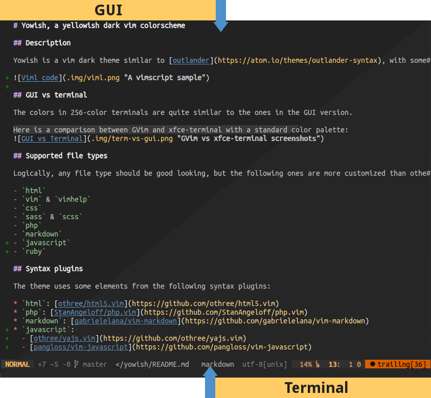
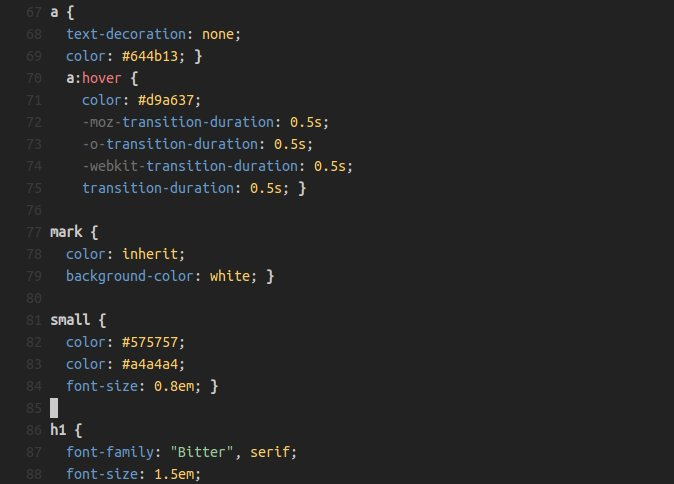
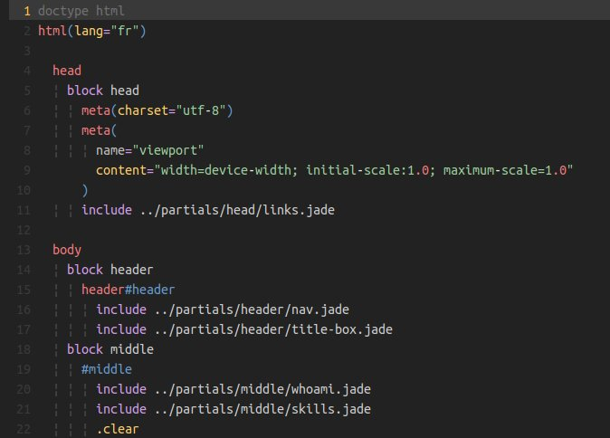

# Yowish<small>, a yellowish dark vim colorscheme</small>


## Description

Yowish is a vim dark theme similar to [outlander](https://atom.io/themes/outlander-syntax), with some yellow in it :smiley:  
It works well on both GUI & 256-colors terminal.


See supported [file types](#filetypes), customized [plugins](#plugins) and [screens](#screens).

## GUI vs terminal

The colors in 256-color terminals are quite similar to the ones in the GUI version.  
Here is a comparison between GVim and xfce-terminal with a standard color palette:



## Supported file types <a id="filetypes"></a>

Normally, any file type should be good looking, but some are more customized than others, check the [screens](#screens).

## Syntax plugins

The theme uses some elements from the following syntax plugins:

* `html`: [othree/html5.vim](https://github.com/othree/html5.vim)
* `pug`: [vim-pug](https://github.com/digitaltoad/vim-pug) (Formerly `jade`)
* `javascript`:
  - [othree/yajs.vim](https://github.com/othree/yajs.vim)
  - [pangloss/vim-javascript](https://github.com/pangloss/vim-javascript)
* `markdown`: [gabrielelana/vim-markdown](https://github.com/gabrielelana/vim-markdown)
* `php`: [StanAngeloff/php.vim](https://github.com/StanAngeloff/php.vim)

## Other plugins <a id="plugins"></a>

The theme provides custom colors for the following plugins (Note that you can disable them, see [configuration](#configuration) for that).

* [CtrlP](https://github.com/ctrlpvim/ctrlp.vim)  


* [Unite](https://github.com/Shougo/unite.vim)  


* [NERDTree](https://github.com/scrooloose/nerdtree)  


* Two [airline](https://github.com/vim-airline/vim-airline) themes:  
  * yowish  
  
  * yowishU (*U for Unity*)  
  

* [Agit](http://github.com/cohama/agit.vim)  
  

## Installation

Copy the distributed files into Vim runtime directory which is usually `~/.vim/`, or `$HOME/vimfiles` on Windows.

Or in a better way, use a vim plugin manager:

| Plugin manager                                         | In vimrc                         | Installation command |
|--------------------------------------------------------|----------------------------------|----------------------|
| [Vim-plug](https://github.com/junegunn/vim-plug)       | `Plug 'KabbAmine/yowish.vim'`      | `PlugInstall`          |
| [Vundle](https://github.com/gmarik/Vundle.vim)         | `Plugin 'KabbAmine/yowish.vim'`    | `PluginInstall`        |
| [NeoBundle](https://github.com/Shougo/neobundle.vim)   | `NeoBundle 'KabbAmine/yowish.vim'` | `NeoBundleInstall`     |

## Configuration <a id="configuration"></a>

The configuration of the plugin is stocked in one global dictionary `g:yowish`.  
To define/modify an option you can either:

```
let g:yowish = {}
let g:yowish.option1 = 'foo'
let g:yowish.option2 = 0
```

Or:

```vim
let g:yowish = {
			\ 'option1': 'foo',
			\ 'option2': 0
		\ }
```

## Options

**Be sure to define options before loading the colorescheme**

| key                       | default value             | description                      |
| ------------------------- | ------------------------- | -------------------------------- |
| `term_italic`             | `0`                       | Use italic in terminal           |
| `ctrlp`                   | `1`                       | Custom colors for CtrlP          |
| `unite`                   | `1`                       | Custom colors for Unite          |
| `nerdtree`                | `1`                       | Custom colors for NERDTree       |
| `agit`                    | `1`                       | Custom colors for Agit           |

## Screens <a id="screens"></a>

Feel free to add screens for other file types or plugins.

`css`



`html`


`pug`



`javascript`


`php`


`ruby`


`scss`


`sh`


Diff with `coffeescript` files.


## Notes

Being the 1st vim colorscheme that I'm developing, feel free to report issues.
Pull requests are welcome, but please provide a before/after screenshot.

And if you're asking yourself, yeah I like yellow :smile:

## Todo

- Support more plugins if needed
- Better support for the following file types (PR are more than welcome):
  - [ ] `python`
  - [ ] `c`
  - [ ] `java`

## Thanks

Thanks to Bram Moolenaar for creating the best piece of software in the world :heart:

Thanks to you if you're using yowish.
